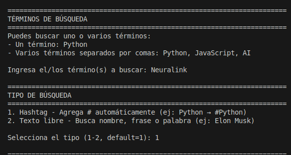

# Twitter/X Scraper - Extractor de Conversaciones

**Versión:** 0.5
**Autor:** [@hex686f6c61](https://x.com/hex686f6c61)
**GitHub:** [686f6c61/Twitter-Xcom-Scraping](https://github.com/686f6c61/Twitter-Xcom-Scraping)

Script de Python para extraer conversaciones completas de Twitter/X en torno a hashtags, términos de búsqueda o nombres específicos usando la API de RapidAPI.

## Descripción

Este proyecto permite extraer y almacenar conversaciones completas de Twitter/X, incluyendo tweets principales y sus respuestas, con paginación automática hacia atrás en el tiempo. Los datos se guardan en formato JSON estructurado para análisis posterior.

## Características

- **Búsqueda flexible**: Por hashtags o texto libre (nombres, frases, palabras clave)
- **Múltiples modos de búsqueda**:
  - **Latest**: Tweets ordenados cronológicamente (del más nuevo al más antiguo)
  - **Top**: Tweets más populares por engagement (likes, retweets)
  - **Photos**: Solo tweets que contienen imágenes
  - **Videos**: Solo tweets que contienen videos
- **Paginación automática**: Extrae todos los tweets disponibles retrocediendo en el tiempo
- **Límite de tweets**: Configurable o ilimitado (todos los disponibles)
- **Filtro por rango de fechas** (NUEVO en v0.2):
  - Buscar tweets en un rango específico (ej: del 01-10-2024 al 15-10-2024)
  - Opción de especificar solo fecha inicial, solo fecha final, o ambas
  - Formato: DD-MM-YYYY
- **Guardado incremental** (NUEVO en v0.3):
  - Guarda progresivamente durante la descarga
  - Después de cada página de tweets descargada
  - Cada 5 tweets procesados con sus respuestas
  - Protección contra pérdida de datos en caso de interrupción
- **Control de interrupciones** (NUEVO en v0.5):
  - Presiona Ctrl+C durante la descarga para pausar
  - Pregunta si deseas detener definitivamente o continuar
  - Guarda automáticamente el progreso al interrumpir
  - Permite reanudar descargas interrumpidas más tarde
- **Reanudación automática** (v0.4):
  - Detecta automáticamente descargas interrumpidas al iniciar
  - Muestra lista de descargas incompletas con estadísticas
  - Continúa desde la fecha más antigua descargada
  - Evita duplicados combinando tweets por ID
  - Actualiza el mismo archivo sin crear duplicados
- **Búsqueda múltiple**: Permite buscar varios términos en una sola ejecución separándolos por comas
- **Respuestas incluidas**: Opción de extraer todas las respuestas de cada tweet
- **Almacenamiento organizado**: Todos los archivos JSON se guardan en la carpeta `scraping/`
- **Información detallada**: Incluye likes, retweets, fechas, usuarios, multimedia, etc.

### Opciones Avanzadas (Opcionales)

El script incluye funcionalidades avanzadas que se activan solo si el usuario lo solicita:

- **Exportar a CSV**: Genera archivo CSV adicional con los datos tabulados para análisis en Excel/LibreOffice
- **Filtro por likes**: Extrae solo tweets con un mínimo de likes especificado
- **Solo verificados**: Filtra únicamente tweets de usuarios verificados (insignia azul o verificación legacy)
- **Modo monitoreo continuo**: Ejecuta búsquedas periódicas durante un tiempo determinado
  - Duración configurable: 10 horas, 24 horas, 2 días o indefinido (hasta Ctrl+C)
  - Intervalo configurable entre búsquedas (por defecto 5 minutos)
  - Detección automática de tweets duplicados
  - Contador de tweets nuevos por iteración

## Requisitos

### API Key de RapidAPI

Necesitas suscribirte a la API de Twitter/X en RapidAPI:

**URL de suscripción**: https://rapidapi.com/scraper-factory-scraper-factory-default/api/easy-x-com-twitter-api

### Planes Disponibles

| Plan | Precio | Búsquedas/Día | Búsquedas/Mes | Precio Extra | Rate Limit |
|------|--------|---------------|---------------|-------------|------------|
| **Basic** | $15.00/mes | 25.000 | 150.000 | $0.001/request | 5 req/s |
| **Pro** | $15.00/mes | 25.000 | 150.000 | $0.001/request | 5 req/s |
| **Ultra** (Recomendado) | $60.00/mes | 75.000 | 700.000 | $0.001/request | 10 req/s |
| **Mega** | $100.00/mes | 125.000 | 2.000.000 | $0.01/request | 15 req/s |

**Nota**: Todos los planes incluyen funcionalidad de búsqueda (Search).

### Dependencias de Python

```bash
pip install -r requirements.txt
```

Paquetes requeridos:
- `requests` - Para realizar peticiones HTTP a la API
- `python-dotenv` - Para gestión de variables de entorno

## Instalación

1. **Clonar o descargar el proyecto**

2. **Instalar dependencias**:
```bash
pip install -r requirements.txt
```

3. **Configurar credenciales**:

Edita el archivo `.env` con tus credenciales de RapidAPI:

```env
RAPIDAPI_KEY=tu_api_key_aqui
RAPIDAPI_HOST=easy-x-com-twitter-api.p.rapidapi.com
```

Para obtener tu API key:
- Ve a https://rapidapi.com/scraper-factory-scraper-factory-default/api/easy-x-com-twitter-api
- Suscríbete a un plan
- Copia tu `X-RapidAPI-Key` desde el dashboard

## Uso

### Ejecución básica

```bash
python3 download_hashtag.py
```

El script te guiará interactivamente a través de las siguientes opciones:



1. **Término a buscar**: Ingresa el hashtag o texto (ej: "Python", "Elon Musk")
2. **Tipo de búsqueda**:
   - Hashtag (agrega # automáticamente)
   - Texto libre
3. **Modo de búsqueda**: Latest, Top, Photos o Videos
4. **Cantidad de tweets**: Número específico o Enter para todos
5. **Rango de fechas** (opcional): Desde DD-MM-YYYY hasta DD-MM-YYYY
6. **Incluir respuestas**: s/n


7. **Opciones avanzadas** (opcional):
   - Exportar a CSV
   - Filtro por likes mínimos
   - Solo usuarios verificados
   - Modo monitoreo continuo con duración e intervalo configurables


### Ejemplos de uso

**Ejemplo 1: Extraer últimos 100 tweets sobre Python**
```
Término: Python
Tipo: 1 (Hashtag)
Modo: 1 (Latest)
Cantidad: 100
Fecha: [Enter]
Respuestas: n
```

**Ejemplo 2: Extraer tweets populares con fotos sobre "Elon Musk"**
```
Término: Elon Musk
Tipo: 2 (Texto libre)
Modo: 3 (Photos)
Cantidad: 50
Fecha: [Enter]
Respuestas: n
```

**Ejemplo 3: Extraer toda la conversación desde una fecha**
```
Término: Guillermo Fernández Vara
Tipo: 2 (Texto libre)
Modo: 1 (Latest)
Cantidad: [Enter] (todos)
Fecha: 01-10-2025
Respuestas: s
```

## Estructura del Proyecto

```
Xcom/
├── download_hashtag.py      # Script principal
├── requirements.txt         # Dependencias Python
├── .env                     # Credenciales API (no incluir en git)
├── README.md               # Este archivo
└── scraping/               # Carpeta con resultados JSON (creada automáticamente)
    ├── Chistorras_20251005_212827.json
    ├── Chistorras_20251005_212858.csv
    └── ...
```

## Formato de Salida (JSON)

Los archivos JSON generados tienen la siguiente estructura:

```json
{
  "query": "Python",
  "search_type": "hashtag",
  "mode": "latest",
  "downloaded_at": "2025-10-05T13:52:29.891339",
  "total_main_tweets": 100,
  "total_replies": 45,
  "total_items": 145,
  "tweets": [
    {
      "tweet": {
        "id": "1974802418702688333",
        "text": "Contenido del tweet...",
        "username": "usuario",
        "name": "Nombre Usuario",
        "timestamp": 1759664704,
        "time_parsed": "2025-10-05T13:51:44Z",
        "likes": 42,
        "retweets": 15,
        "replies": 3,
        "views": 1250,
        "hashtags": ["Python", "Programming"],
        "photos": [...],
        "videos": [...],
        "urls": [...]
      },
      "replies": [
        {
          "id": "...",
          "text": "...",
          ...
        }
      ]
    }
  ]
}
```

## Notas para Desarrolladores

### Arquitectura del Código

El proyecto está estructurado en una clase principal `TwitterHashtagScraper` con los siguientes métodos:

#### `__init__()`
Inicializa la conexión con la API:
- Carga credenciales desde variables de entorno usando `python-dotenv`
- Valida que `RAPIDAPI_KEY` y `RAPIDAPI_HOST` estén definidos
- Configura headers para peticiones HTTP

```python
self.headers = {
    'X-RapidAPI-Key': self.api_key,
    'X-RapidAPI-Host': self.api_host
}
```

#### `search_tweets(query, mode, max_tweets, is_hashtag, until_date)`
Método principal para búsqueda de tweets:

**Parámetros**:
- `query` (str): Término de búsqueda
- `mode` (str): 'latest', 'top', 'photos', 'videos'
- `max_tweets` (int|None): Límite de tweets o None para todos
- `is_hashtag` (bool): Si True, agrega '#' al query
- `until_date` (str|None): Fecha límite en formato YYYY-MM-DD

**Proceso**:
1. Prepara el query (agrega # si es hashtag)
2. Convierte `until_date` de DD-MM-YYYY a timestamp Unix
3. Realiza petición GET a `/v1/search/tweets`
4. Extrae tweets de la estructura `data.tweets` (no directamente de `tweets`)
5. Itera usando el `cursor` para paginación
6. Por cada página:
   - Actualiza contadores (page_count, tweet_count)
   - Rastrea fecha más antigua/nueva
   - Verifica si se alcanzó `until_date` (compara timestamps)
   - Verifica si se alcanzó `max_tweets`
7. Retorna lista de tweets

**Manejo de errores**:
- HTTPError 403: Problema de suscripción (muestra instrucciones)
- Excepciones genéricas: Muestra error y continúa

#### `get_tweet_replies(tweet_id)`
Obtiene respuestas de un tweet específico:

**Parámetros**:
- `tweet_id` (str): ID del tweet

**Proceso**:
1. Realiza petición GET a `/v1/tweets/{tweet_id}/replies`
2. Pagina usando cursor hasta agotar respuestas
3. Incluye pausa de 0.5s entre peticiones para evitar rate limiting
4. Retorna lista de respuestas

#### `download_full_conversation(query, mode, max_tweets, include_replies, is_hashtag, until_date)`
Orquesta la descarga completa:

**Proceso**:
1. Llama a `search_tweets()` para obtener tweets principales
2. Crea estructura de datos con metadata
3. Si `include_replies=True`:
   - Itera sobre cada tweet
   - Llama a `get_tweet_replies()` para cada uno
   - Muestra progreso (Tweet X/Y - ID: ...)
4. Calcula estadísticas finales
5. Retorna diccionario completo

#### `save_to_json(data, filename)`
Guarda resultados en JSON:

**Proceso**:
1. Crea carpeta `scraping/` si no existe (usando `os.makedirs`)
2. Genera nombre de archivo: `{query}_{timestamp}.json`
3. Sanitiza el query (elimina '#' y reemplaza espacios por '_')
4. Guarda con `json.dump(ensure_ascii=False, indent=2)` para soportar UTF-8
5. Retorna ruta completa del archivo

#### `main()`
Función de entrada interactiva:

**Flujo**:
1. Instancia `TwitterHashtagScraper()`
2. Solicita inputs del usuario (con validaciones)
3. Convierte fecha DD-MM-YYYY a YYYY-MM-DD
4. Llama a `download_full_conversation()`
5. Guarda con `save_to_json()`
6. Muestra resumen final

### Consideraciones Técnicas

#### Estructura de Respuesta de la API

La API devuelve datos en formato:
```json
{
  "status": "success",
  "data": {
    "cursor": "...",
    "tweets": [...]
  }
}
```

**Importante**: Los tweets NO están directamente en `response['tweets']` sino en `response['data']['tweets']`. El código maneja ambos casos por compatibilidad:

```python
if 'data' in data and 'tweets' in data['data']:
    tweets = data['data']['tweets']
    cursor = data['data'].get('cursor')
else:
    tweets = data.get('tweets', [])
```

#### Paginación

La paginación se realiza mediante el parámetro `cursor`:
- Primera petición: sin cursor
- Peticiones subsecuentes: incluir `cursor` del response anterior
- Cuando `cursor` es None o vacío: no hay más páginas

```python
params = {'query': search_query, 'mode': mode}
if cursor:
    params['cursor'] = cursor
```

#### Rate Limiting

El código incluye pausas entre peticiones:
- 1 segundo entre páginas de tweets (`time.sleep(1)`)
- 0.5 segundos entre peticiones de respuestas (`time.sleep(0.5)`)

Esto previene exceder los límites del plan (5-15 req/s según plan).

#### Timestamps y Fechas

Los tweets incluyen dos formatos de fecha:
- `timestamp`: Unix timestamp (integer)
- `time_parsed`: ISO 8601 string (YYYY-MM-DDTHH:MM:SSZ)

Para filtrado por fecha:
```python
until_timestamp = int(dt.strptime(until_date, '%Y-%m-%d').timestamp())
if tweet_timestamp < until_timestamp:
    # Detener búsqueda
```

#### Gestión de Caracteres Especiales

El código soporta UTF-8 correctamente:
- `json.dump(ensure_ascii=False)` permite caracteres no-ASCII
- Abre archivos con `encoding='utf-8'`
- Sanitiza nombres de archivo reemplazando espacios y '#'

### Testing

Para pruebas durante desarrollo, usar límite de 10 tweets para minimizar uso de la API:

```python
# En lugar de hacer búsquedas ilimitadas durante desarrollo
max_tweets = 10  # Limitar para testing
```

### Ejemplos de Archivos Generados

El proyecto incluye archivos de ejemplo en la carpeta `scraping/`:

**Búsqueda: Neuralink (hashtag, modo top, 25 tweets)**
- `scraping/Neuralink_20251005_144420.json` - Datos completos en formato JSON
- `scraping/Neuralink_20251005_144420.csv` - Exportación tabular para análisis

Estos archivos sirven como referencia para entender la estructura de datos generada y los formatos de exportación disponibles.

### Manejo de Errores

El código incluye manejo básico de errores:
- Validación de variables de entorno al inicio
- Try-except en peticiones HTTP
- Validación de formato de fecha
- Mensajes informativos al usuario

**Mejoras recomendadas**:
- Logging estructurado (usar `logging` module)
- Retry con backoff exponencial para errores transitorios
- Validación de inputs del usuario
- Guardar estado para reanudar descargas interrumpidas

## Limitaciones

- La API solo proporciona acceso a tweets públicos
- El histórico disponible depende del plan contratado (típicamente 7-30 días)
- Los rate limits pueden afectar descargas masivas
- Cuentas privadas no son accesibles
- Algunos tweets pueden estar restringidos por región

## Changelog

### v0.5 (05 de Octubre de 2025)
- **Control de interrupciones con Ctrl+C**
  - Presiona Ctrl+C durante la descarga para pausar
  - Pregunta si deseas detener definitivamente o continuar
  - Guarda automáticamente el progreso al interrumpir
  - Permite reanudar descargas interrumpidas más tarde
  - Segunda pulsación de Ctrl+C detiene forzosamente

### v0.4 (05 de Octubre de 2025)
- **Reanudación automática de descargas**: Recupera descargas interrumpidas
  - Detecta automáticamente archivos con status "in_progress"
  - Muestra lista interactiva de descargas incompletas
  - Extrae fecha más antigua y configura búsqueda desde ese punto
  - Evita duplicados usando IDs de tweets
  - Combina datos existentes con nuevos tweets
  - Actualiza el mismo archivo JSON

### v0.3 (05 de Octubre de 2025)
- **Guardado incremental**: Guarda progreso durante la descarga
  - Guardado automático después de cada página de tweets
  - Guardado cada 5 tweets procesados con respuestas
  - Protección contra pérdida de datos por interrupciones
  - Evita duplicación de archivos JSON
- Fix: Validación de input numérico en filtro de likes

### v0.2 (05 de Octubre de 2025)
- Añadido filtro por rango de fechas (desde-hasta)
- Mejoras en la interfaz de selección de fechas
- Optimización del filtrado de tweets por timestamp

### v0.1 (05 de Octubre de 2025)
- Versión inicial
- Búsqueda por hashtag y texto libre
- Múltiples modos de búsqueda (Latest, Top, Photos, Videos)
- Exportación a JSON y CSV
- Modo monitoreo continuo
- Tests de integración con API real

## Licencia

Este proyecto es de uso educativo y personal. Asegúrate de cumplir con los términos de servicio de Twitter/X y RapidAPI al usar este script.

## Soporte

Para problemas o dudas:
1. Verifica que tu API key esté activa en RapidAPI
2. Confirma que tienes créditos disponibles en tu plan
3. Revisa los logs de errores en la consola
4. Consulta la documentación de la API: https://rapidapi.com/scraper-factory-scraper-factory-default/api/easy-x-com-twitter-api
